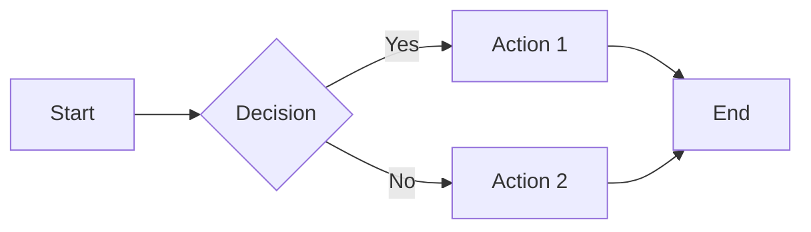

# Examples of Unsupported MkDocs Features

This file contains examples of MkDocs/Material/PyMdown features that are **not yet supported** by mdformat-mkdocs but would benefit from auto-formatting.

> **Note**: This file is for reference only and will not format correctly with the current version of mdformat-mkdocs.

---

## 1. PyMdown Keys (Keyboard Shortcuts)

Press ++ctrl+alt+delete++ to open the task manager.

Use ++cmd+shift+p++ to open the command palette in VS Code.

Navigate with ++arrow-up++ and ++arrow-down++ keys.

**What formatting could do:**
- Normalize capitalization (Ctrl vs ctrl vs CTRL)
- Consistent spacing around key combinations
- Validate key names

---

## 2. Critic Markup (Change Tracking)

This is {--old--} {++new++} text.

We need to {~~fix this~>correct this~~} issue.

This section {==needs review==}.

{>>This is a comment from the reviewer<<}

**What formatting could do:**
- Normalize spacing inside markers
- Validate matching opening/closing delimiters
- Format multi-line critic blocks
- Ensure proper nesting

---

## 3. Material Annotations (v8.0+)

Lorem ipsum dolor sit amet, (1) consectetur adipiscing elit. (2)
{ .annotate }

1. This is the first annotation with helpful information
2. This is the second annotation with more context

**What formatting could do:**
- Align annotation numbers with their definitions
- Validate number sequences (1, 2, 3...)
- Ensure proper spacing and indentation
- Format annotation blocks consistently

---

## 4. Enhanced Task Lists

Simple task list:

- [x] Completed task
- [ ] Incomplete task
- [X] Also completed (uppercase X)

Nested task list:

- [x] Parent task
    - [x] Child task 1
    - [ ] Child task 2
- [ ] Another parent task

**What formatting could do:**
- Normalize checkbox markers (always `[x]` or always `[X]`)
- Consistent spacing after checkbox
- Handle indentation of multi-line task items

---

## 5. SmartSymbols

Copyright (c) 2024 Example Corp.

This is a trademark (tm) symbol.

Registered trademark (r) here.

Em dash --- between clauses.

En dash -- for ranges.

Arrow --> pointing right.

Arrow <-- pointing left.

**What formatting could do:**
- Preserve converted symbols during formatting
- Optionally normalize to ASCII or Unicode consistently
- Ensure symbols are not escaped incorrectly

---

## 6. MagicLink

Auto-link examples that need preservation:

Visit https://example.com for more info.

Email us at support@example.com

GitHub mention: @username

Issue reference: #123

Pull request: !456

**What formatting could do:**
- Normalize URL schemes (http vs https)
- Format email addresses consistently
- Ensure proper spacing around auto-generated links
- Validate repository references

---

## 7. Material Grids (Card Layouts)

- :material-clock-fast: **Set up in 5 minutes**

    ---

    Install with pip and get started in minutes

- :fontawesome-brands-markdown: **It's just Markdown**

    ---

    Focus on content, Material handles the layout

- :material-scale-balance: **Open Source, MIT**

    ---

    Licensed under MIT, free forever

**What formatting could do:**
- Consistent HTML tag formatting
- Normalize spacing between grid items
- Format markdown within grid cards
- Ensure proper attribute formatting

---

## 8. Highlight

This is ==highlighted text== in the paragraph.

You can ==mark== important ==sections== like this.

**What formatting could do:**
- Preserve highlight markers during wrapping
- Consistent spacing within markers
- Handle nested or adjacent highlights

---

## 9. Caret & Tilde (Super/Subscript)

Chemical formula: H^2^O

Another example: E = mc^2^

Subscript example: CH~3~CH~2~OH

**What formatting could do:**
- Preserve superscript/subscript markers
- Validate nesting and pairing
- Handle spacing around markers

---

## 10. Emoji and Icons

Smiley face :smile: in text.

Material icon :material-account-circle: here.

FontAwesome icon :fontawesome-brands-github: there.

**What formatting could do:**
- Validate emoji shortcodes
- Normalize icon syntax format
- Consistent spacing around emoji

---

## 11. InlineHilite (Inline Code with Syntax)

Use `:::python import sys` to import the sys module.

Or `:::javascript const x = 10;` for JavaScript.

**What formatting could do:**
- Preserve language hints
- Validate language identifiers
- Consistent spacing within inline code

---

## 12. ProgressBar

Project completion:

[=0% "Not started"]

[=25% "Quarter done"]

[=50% "Half way"]

[=75% "Almost there"]

[=100% "Complete!"]

**What formatting could do:**
- Normalize percentage formats
- Validate percentage values (0-100)
- Consistent spacing and quote usage

---

## 13. Details (Collapsible Blocks)

Note: This might already be supported via Material Admonitions, but native Details syntax:

??? note "Click to expand"
    This content is collapsed by default

???+ tip "Open by default"
    This content is shown by default

**What formatting could do:**
- Consistent spacing and indentation
- Normalize open/closed state markers
- Format content within details blocks

---

## 14. Custom Fences (Mermaid)

**What formatting could do:**
- Format mermaid code with proper indentation
- Validate mermaid syntax
- Normalize diagram structure

---

## Conclusion

These examples demonstrate the variety of MkDocs features that could benefit from consistent auto-formatting. Each feature has specific syntax rules and edge cases that would be handled by dedicated plugins.

For full analysis and implementation recommendations, see:
- [RESEARCH_UNSUPPORTED_FEATURES.md](./RESEARCH_UNSUPPORTED_FEATURES.md)
- [RESEARCH_SUMMARY.md](./RESEARCH_SUMMARY.md)
