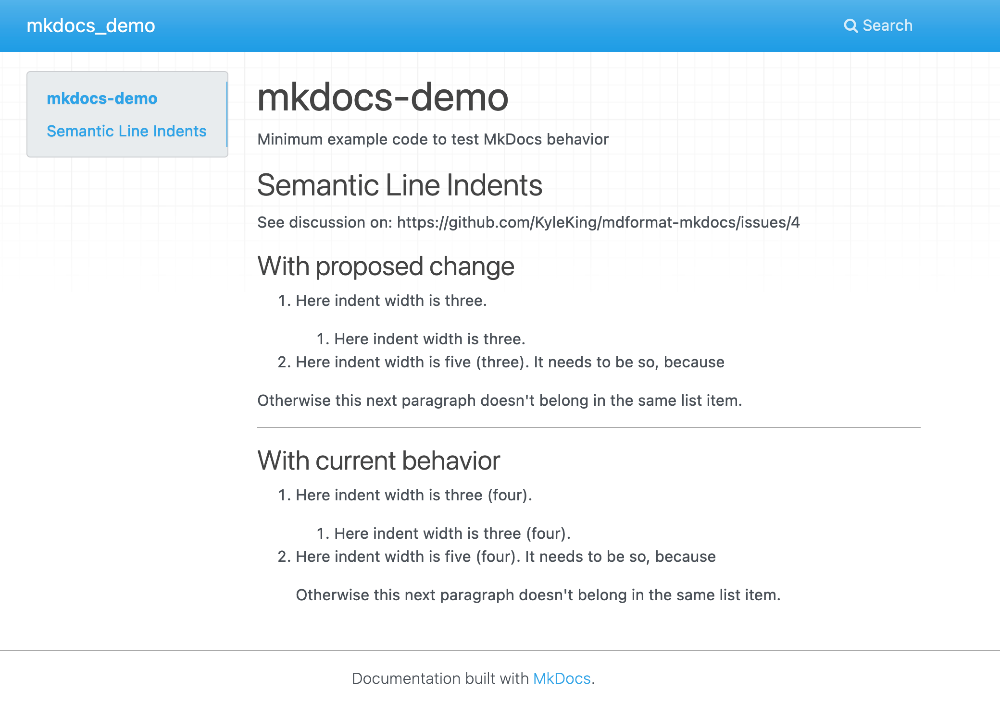

# MkDocs Example

Minimum example code to test MkDocs behavior

## Usage

1. Install dependencies

    ```sh
    cd mkdocs-demo
    poetry install
    ```

1. Start the server at: <http://127.0.0.1:8000>, which will render the markdown files in `docs/*.md`. You can edit these files in real time

    ```sh
    poetry run mkdocs serve
    ```


